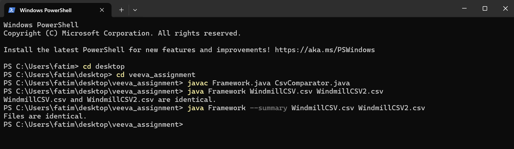

# CSV Comparison Framework (Java)

This project is a lightweight Java-based automation framework that compares two CSV files and reports their differences by row and column. It’s designed to be reusable as both a command-line tool and a library.

---

## Features

- Row-by-row, column-by-column comparison of CSV files
- Reports differences in values, missing rows, and mismatched columns
- `--summary` flag for high-level diff status
- Includes JUnit 5 tests
- Reusable `CsvComparator` utility class for integration into other tools

---

## File Structure

- CsvComparator.java (Core comparison logic)
- Framework.java (Command-line interface)
- CsvComparatorTest.java (JUnit tests for comparison logic)
- junit-platform-console-standalone-1.9.3.jar (for running tests)
- README.md
- image.png (Screenshot example of running the program)

---

## Requirements

- Java 11 or later
- JUnit 5 (via standalone JAR)

---

## How to Run

1. Download the .ZIP file
2. Extract all files
3. Open a terminal in the folder
4. Compile and run using file inputs (each time you run the program, you can change the input file names)
```bash
javac Framework.java CsvComparator.java
java Framework WindmillCSV.csv WindmillCSV2.csv
```
5. (optional) To use "--summary" for a simple answer
```bash
java Framework --summary DahlCSV.csv DahlCSV.csv
```

#### File names used to test the program:
- For same content: WindmillCSV.csv & WindmillCSV2.csv
- For different content: DahlCSV.csv & DahlCSV.csv
- For same content, different length: DahlCSV.csv & DahlCSV3.csv



---

## Running Tests Using JUnit (Windows)

1. Download junit-platform-console-standalone-1.9.3.jar
2. Compile the code with the JUnit JAR:
```bash
javac -cp ".;junit-platform-console-standalone-1.9.3.jar" CsvComparator.java CsvComparatorTest.java
```
3. Run the tests:
```bash
java -jar junit-platform-console-standalone-1.9.3.jar --class-path . --scan-class-path
```
### Test cases cover:
- Identical files
- Different values
- Missing rows
- Column mismatches
- Empty files

---

## Framework Design
#### CsvComparator
- Reusable class with compare() method. Can be used in other Java programs
#### Framework
- Command-line entry point that parses flags and calls the comparator
#### --summary flag	
- Skips detailed diff and prints "Files are identical" or "Files differ"

---

## Author Notes
#### This framework was built to demonstrate:
- CLI design in Java
- File I/O and string processing
- Separation of concerns
- Basic test automation using JUnit

---

## Author
#### Fatimah Sweilem